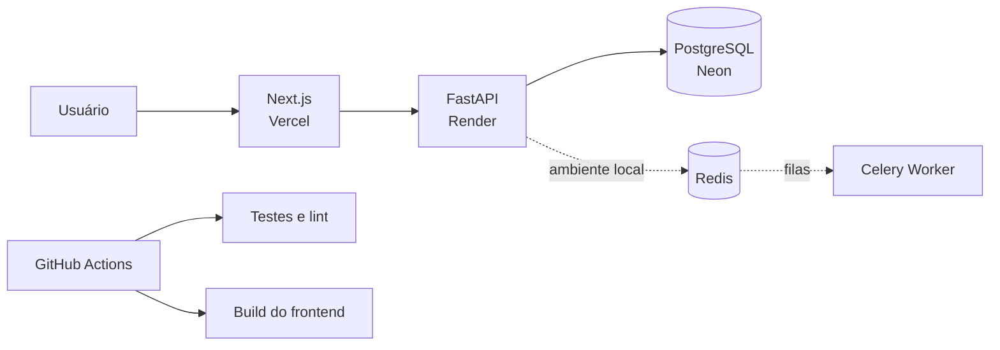
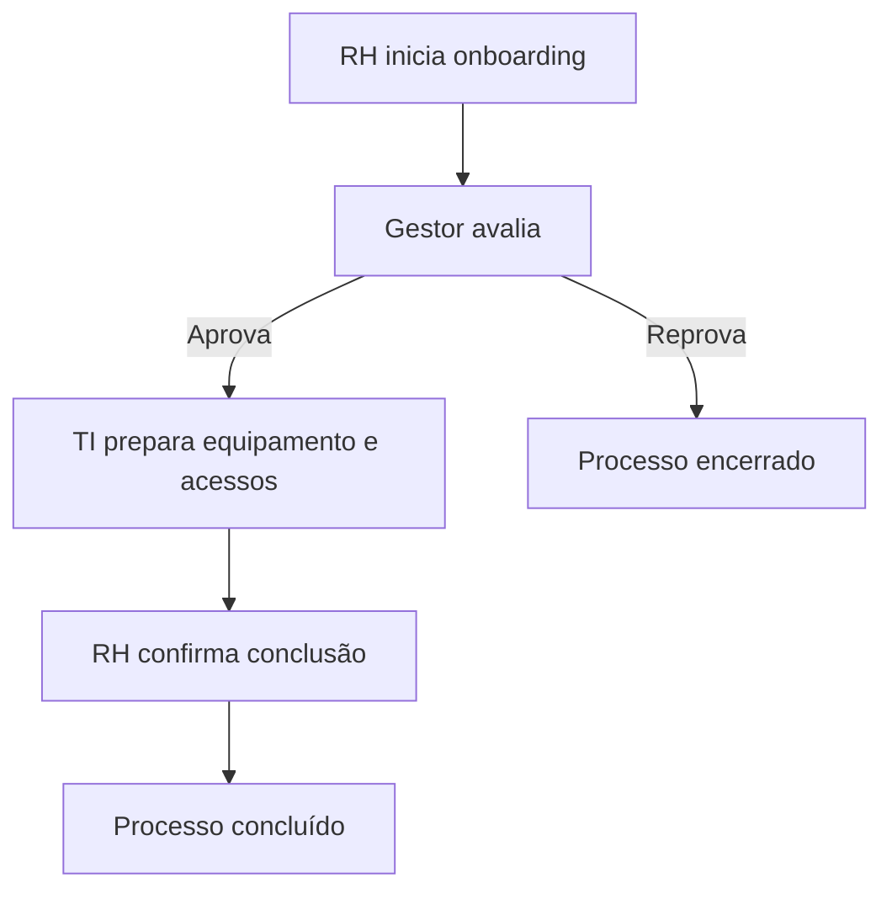

# OpsFlow

SaaS multi-tenant para desenhar, executar e auditar processos internos.

O OpsFlow transforma solicitações informais — e-mails, planilhas e mensagens — em fluxos padronizados com responsáveis, aprovações, prazos, rastreabilidade e indicadores. O produto atende processos como onboarding e offboarding, acessos, compras, férias, reembolsos, chamados internos e aprovações financeiras.

**Demo:** https://opsflow-ebon.vercel.app

**API:** https://opsflow-api-x066.onrender.com/docs

> A API usa o plano gratuito do Render e pode levar até um minuto para responder ao primeiro acesso após um período de inatividade.

   

## Para recrutadores

O OpsFlow é um projeto full stack construído para demonstrar competências de **Software Engineering**, **Backend Python**, **Cloud/DevOps** e fundamentos de **Data Engineering** em um cenário corporativo real.

Em poucos minutos é possível avaliar:

- modelagem de um SaaS multi-tenant;
- autenticação JWT, autorização RBAC e isolamento de dados;
- regras de negócio para workflows e aprovações sequenciais;
- API REST documentada com Swagger/OpenAPI;
- frontend responsivo integrado à API;
- persistência PostgreSQL e processamento assíncrono com Redis/Celery;
- containers, configuração por ambiente, testes automatizados e CI/CD;
- implantação real com Vercel, Render e Neon.

### Links rápidos

| Recurso | Link |
|---|---|
| Aplicação pública | [Abrir OpsFlow](https://opsflow-ebon.vercel.app) |
| Demonstração sem cadastro | Clique em **Explorar demonstração** na página inicial |
| Documentação interativa da API | [Abrir Swagger](https://opsflow-api-x066.onrender.com/docs) |
| Health check | [Consultar API](https://opsflow-api-x066.onrender.com/health) |
| Especificação funcional | [Ler visão do produto](docs/product.md) |
| Arquitetura e decisões técnicas | [Ler arquitetura](docs/architecture.md) |

> A API utiliza hospedagem gratuita e pode levar cerca de um minuto para despertar após um período sem acessos.

## Visão geral da solução



### Fluxo de negócio demonstrado



## Principais desafios resolvidos

### Multi-tenancy

Uma organização nunca recebe dados de outra. O tenant é extraído do JWT validado e aplicado nas consultas do servidor, em vez de ser aceito como um parâmetro confiável do frontend.

### Integridade do workflow

Somente workflows ativos e com etapas podem ser executados. As tarefas avançam em ordem, uma decisão não pode ser repetida e uma reprovação encerra o processo.

### Segregação de funções

O solicitante não pode aprovar a própria solicitação. Cada etapa define um perfil responsável, e apenas esse perfil ou um administrador pode tomar a decisão.

### Operação e rastreabilidade

Prazos são calculados com base no SLA de cada etapa. Eventos importantes geram registros de auditoria, permitindo reconstruir o histórico de uma execução.

## Competências demonstradas

| Área | Implementação |
|---|---|
| Backend | Python, FastAPI, Pydantic, SQLAlchemy e arquitetura em serviços |
| Frontend | Next.js, React, TypeScript, Tailwind CSS e consumo de API REST |
| Dados | PostgreSQL, modelagem relacional, métricas operacionais e tenant isolation |
| Segurança | JWT, Argon2, RBAC, CORS, secrets por ambiente e audit log |
| Assíncrono | Redis e Celery para verificação de SLAs no ambiente completo |
| Qualidade | Pytest, Ruff, type checking, build de produção e GitHub Actions |
| Infraestrutura | Docker, Docker Compose, Vercel, Render e Neon |

## Estrutura do monorepo

```text
OPSFLOW/
├── frontend/              # Next.js, TypeScript e Tailwind
├── backend/
│   ├── app/               # API, modelos, segurança e regras de negócio
│   └── tests/             # testes automatizados
├── docs/                  # produto, arquitetura, dados, API e segurança
├── .github/workflows/     # pipeline de integração contínua
├── docker-compose.yml     # ambiente completo local
├── render.yaml            # infraestrutura gratuita da API
└── .env.example           # contrato das variáveis de ambiente
```

## Documentação

- [Visão do produto e funcionalidades](docs/product.md)
- [Arquitetura técnica](docs/architecture.md)
- [Modelo de dados](docs/database.md)
- [API e regras de negócio](docs/api.md)
- [Segurança e multi-tenancy](docs/security.md)
- [Roadmap do produto](docs/roadmap.md)

## MVP implementado

- cadastro, login JWT e RBAC (`admin`, `manager`, `member`);
- workflows, etapas com SLA, execuções e aprovações sequenciais;
- bloqueio de autoaprovação e isolamento por organização;
- auditoria, indicadores operacionais e worker para tarefas atrasadas;
- Next.js, FastAPI, PostgreSQL, Redis/Celery, Docker Compose, testes e CI.

## Executar

1. Copie `.env.example` para `.env`.
2. Rode `docker compose up --build`.
3. Abra http://localhost:3000. Swagger: http://localhost:8000/docs.

## Demonstração ponta a ponta

1. Crie a empresa e o usuário administrador.
2. Em **Equipe**, crie um usuário `manager` e um `member`.
3. Em **Workflows**, crie um fluxo ativo e adicione etapas para esses perfis.
4. Em **Execuções**, inicie um onboarding.
5. Entre com o usuário responsável e aprove sua tarefa.
6. Acompanhe o avanço em **Execuções** e os eventos em **Auditoria**.

Sem Docker: o backend usa SQLite por padrão. Rode `pip install -e ".[dev]"` e `pytest` em `backend`.

## API principal

`POST /auth/register`, `POST /auth/login`, `GET/POST/PUT /workflows`, `POST /workflows/{id}/steps`, `GET/POST /executions`, `GET /tasks`, `POST /tasks/{id}/approve`, `POST /tasks/{id}/reject`, `GET /audit-logs` e `GET /analytics/overview` (todos sob `/api/v1`).

## Decisões de engenharia

- isolamento de tenants aplicado em todas as consultas de negócio;
- solicitantes não podem aprovar a própria solicitação;
- tarefas avançam sequencialmente e respeitam o perfil responsável;
- mudanças relevantes deixam trilha de auditoria;
- SLA vencido é processado de forma assíncrona pelo Celery;
- CI executa lint, testes e build a cada push ou pull request.

## Roadmap

OAuth Microsoft/Google, webhooks, notificações, templates de processo, anexos em S3 e camada analítica Bronze/Silver/Gold.

## Status do projeto

MVP funcional e publicado para fins de demonstração e portfólio. A infraestrutura gratuita não possui SLA de produção: o backend pode entrar em suspensão após inatividade e levar aproximadamente um minuto para responder ao primeiro acesso.

## Licença

Projeto de portfólio. Consulte o autor antes de utilizar comercialmente.
